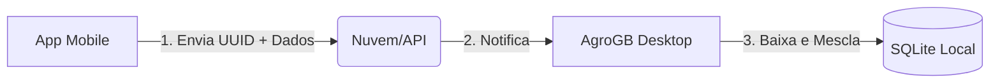

# Arquitetura de Sincronização AgroGB

Para que o App Mobile e o Desktop funcionem juntos, usaremos a seguinte estratégia:

## 1. Identidade Única (UUID)
Cada registro (ex: uma colheita) terá um código único como `8f2d1a3c-b4e5...`.
- Se o celular criar uma colheita offline, ele gera esse código.
- Quando houver internet, ele envia para o servidor.
- O PC baixa esse código e, se já existir, apenas atualiza. Se não existir, cria um novo.

## 2. Fluxo de Dados

## 3. Próximas Implementações Mobile
- [ ] Configurar Projeto Base (React Native).
- [ ] Criar Tela de Login com Token de Sincronização.
- [ ] Desenvolver Formulário de Colheita Rápida.
